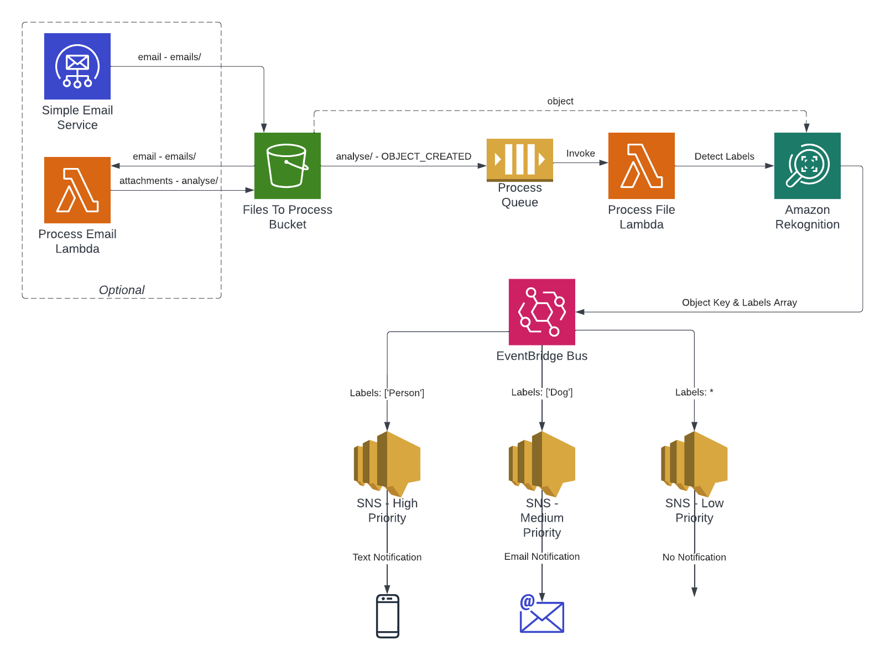

# AWS S3 Rekognition Processing With Events

This project contains a [CDK](https://docs.aws.amazon.com/cd) application that builds a AWS application utilising [SES](https://aws.amazon.com/ses/), [S3](https://aws.amazon.com/s3/), [SNS](https://aws.amazon.com/sns/), [SQS](https://aws.amazon.com/sqs/), [Lambda](https://aws.amazon.com/lambda/) [EventBridge](https://aws.amazon.com/eventbridge/) and [Rekognition](https://aws.amazon.com/rekognition/) which will trigger when images are placed within a bucket (`analyse/` prefix), detect objects in the images and then fire events with these object labels that are then filtered to specific priority based topics for different types of notification.

If SES is setup to [receive email](https://docs.aws.amazon.com/ses/latest/dg/receiving-email-setting-up.html) then this application can be configured with this email address and it will setup a SES rule to store emails to an S3 bucket, there a lambda will trigger to extract the attachment images - which will then trigger the object detection.

## Example Use Case
Snapshots of movement could be uploaded to S3, or extracted from email attachments by [SES](https://aws.amazon.com/ses/), and then depending on the objects that are detected it could send a Text Message, send an Email, or do nothing. For example, a person detected could be a text and email. A dog could trigger an email only, and a bird could simply not notify at all.

This can easily be expanded to store the images, along with labels into an archive for later quering with [Athena](https://aws.amazon.com/athena/) as well. Could also have a lambda that builds and sends an email via SES with the images attached, along with the labels.

## Diagram

## Useful commands

* `npm run build`   compile typescript to js
* `npm run watch`   watch for changes and compile
* `npm run test`    perform the jest unit tests
* `cdk deploy`      deploy this stack to your default AWS account/region
* `cdk diff`        compare deployed stack with current state
* `cdk synth`       emits the synthesized CloudFormation template
